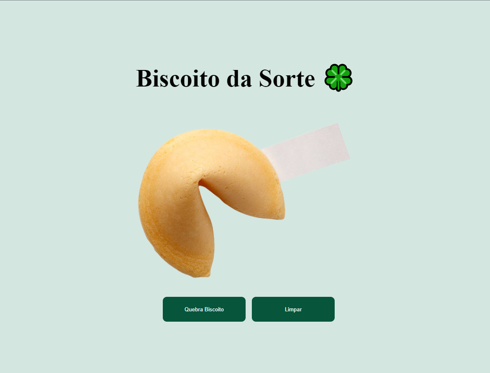
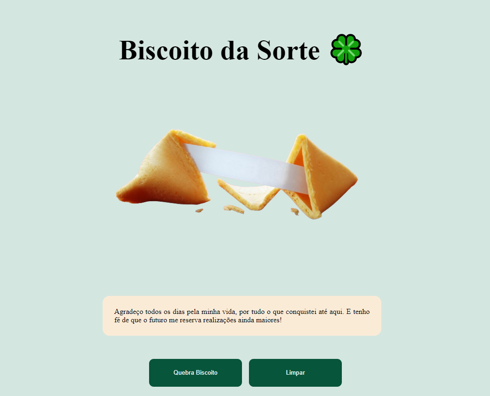

# Biscoito da Sorte

é um sistema de messagem aleatoria, utilizando uma API externa - [Link API](https://github.com/TalissonSouzaDev/Api_Message_Random.git) feito com laravel 10.0


## Instalação / Execução

Instale my-project com npm

```bash
  git clone 
  cd FrontMessageProject
  npm install
  npm run dev
```
    



